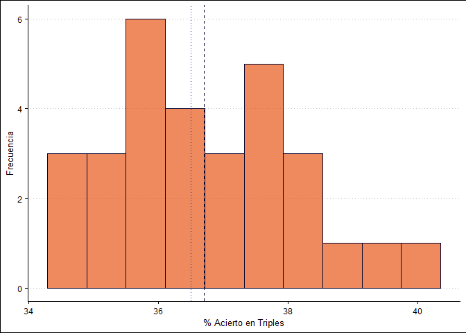
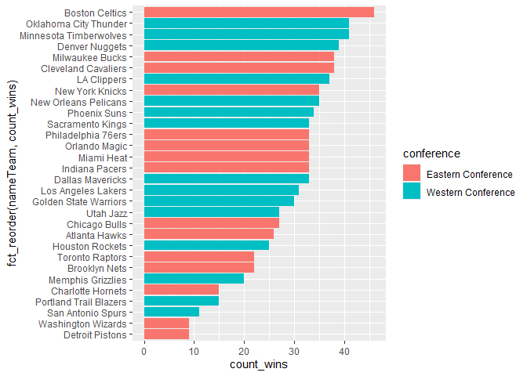

# Data Visualization in R
2024-02-28

# 1. Introducción a la sintaxis de `ggplot2`

# 2. Datos que utilizaremos en el guión

Para esta práctica utilizamos datos de la NBA de la temporada 2023/24
(en curso) a través del paquete `nbastatR` . Será necesario también
tener instalados los paquetes de `tidyverse` y algunos paquetes
adicionales para ayudar a la visualización: `ggdist` , `ggrepel`,
`cowplot` , `ggthemes` y `ggdark` .

Después de instalarlos, cargamos las bibliotecas:

Y cargamos las diferentes bases de datos que vamos a utilizar del
repositorio.

# 3. Estudiar distribuciones de nuestras variables

Estudiar la composciión y distribución de nuestras variables es
fundamental antes de cualquier otro análisis. Esto implica ver qué rango
de valores adopta, qué frecuencia toma cada valor y qué función de
distribución se ajusta mejor a nuestros datos (ej. normal, poisson,
log-normal, etc).

Para ello, lo más útil son los **histogramas**.

### Ejemplo 1. Porcentaje de triples:

Vamos a usar la base de datos `season_average_data` (echadle un ojo
primero al aspecto que tiene). Vamos a ver cómo se distribuyen los
porcentajes de acierto en triples en todos los equipos.

Buscamos un histograma: `geom_histogram()`

Nos hacemos ya una idea de valores. Vamos a ajustarlo un poco para
llegar a la siguiente figura:

Y ahora vamos a personalizar un poco:

- Añadir una línea vertical en la media y en la mediana de acierto en
  triples

- Cambiar los nombres de los ejes a: “% Acierto en Triples” y
  “Frecuencia”

- Vamos a usar un tema del paquete `ggthemes`

Podemos hacer exactamente lo mismo con una curva de frecuencia continua
(*density*) en vez de discreta (*bins*). Lo hacemos con `geom_density()`

### Ejemplo 2. Figuras compuestas:

Vamos a juntar en una misma figura un histograma de triples encestados
(`fg3m`) y de tiros de campo intentados (`fga`). Lo haremos con
`cowplot`. Para ello, los pasos son:

1.  Diseñar un título con `ggdraw() + draw_label()`
2.  Diseñar la figura de `fg3m`
3.  Diseñar la figura de `fga`
4.  Unir la fila de figuras con `plot_grid()`
5.  Componer la figura total con `plot_grid()`

### Ejercicio 1. Estudiar los tiros libres intentados por partido:

Esta variable se llama `fta` (*free throw attempts*) en la base de datos
de `season_average_data` . Hay que lograr una figura como la siguiente:
¿cómo lo haríais?

### Ejercicio 2. Figura compuesta de porcentajes de tiros (triples, tiros de dos, tiros libres)

# 4. Comparar variables categóricas

Para comparar variables categóricas podemos utilizar distintos tipos de
gráficas. Las más comunes son *gráficos de barras* o *barplots*,
*gráficos de caja-bigotes* o *boxplots* y sus variantes.

## Barplots

Son las más utilizadas aunque tengan ciertos problemas que luego
veremos.

Con *ggplot*, utilizaremos la función `geom_barplot()` con el argumento
`stat = "identity"` .

### Ejemplo 1. Clasificación de equipos por número de victorias

Vamos a ver el ejemplo más básico sin ningún argumento más.

Esto no nos indica demasiado. Vamos a mejorar la gráfica:

1.  Intercambiar los ejes para que se lean los equipos con
    `coord_flip()`

2.  Ordenar de menor a mayor con la función `fct_reorder` del paquete
    `forcats`.

    

    3.  Colorear por número de victorias (no se muestra)

    4.  Colorear por porcentaje de triples

    5.  Personalizar ejes

    6.  Dividir por conferencias Este y Oeste

### Ejercicio 3. Clasificación de mejores equipos de cada conferencia:

Hacer una figura compuesta con la clasificación de cada conferencia
(Este y Oeste) en las siguientes categorías.

- Porcentaje de acierto en triples `pct3`

- Rebotes `treb`

- Asistencias `ast`

- Porcentaje de acierto en tiros de campo `pctfg`

Las barras deben estar coloreadas en función de la variable *puntos por
partido* (`pts`).

# 5. Comparar variables cuantitativas
