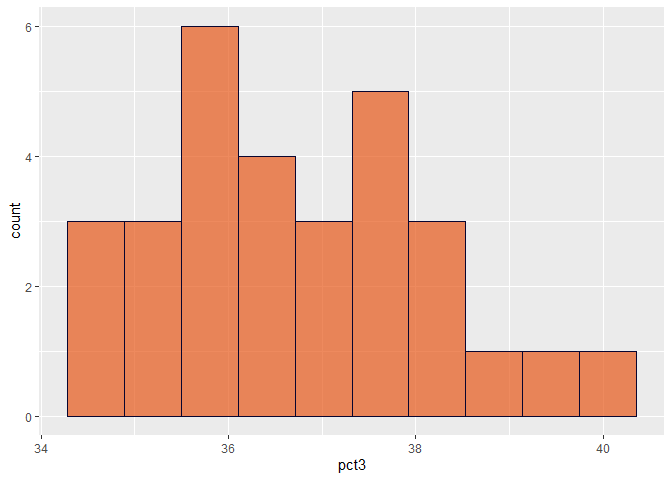
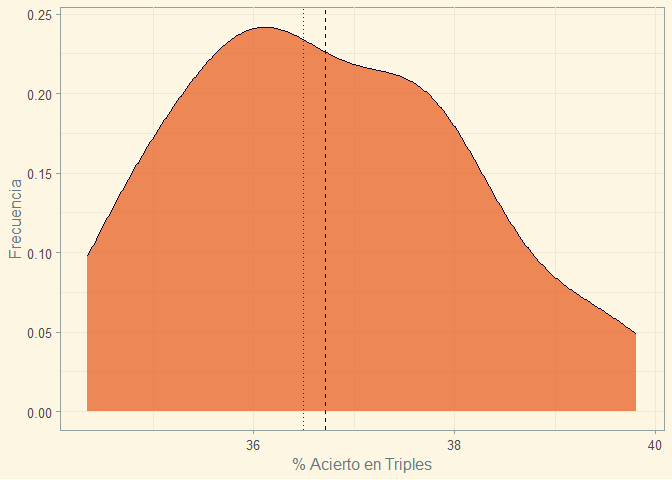
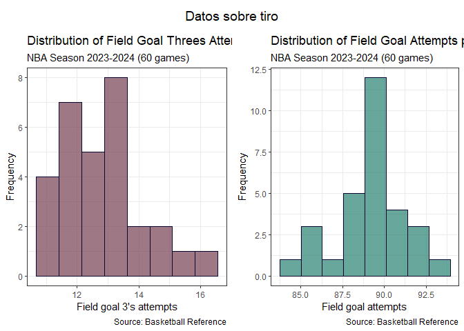
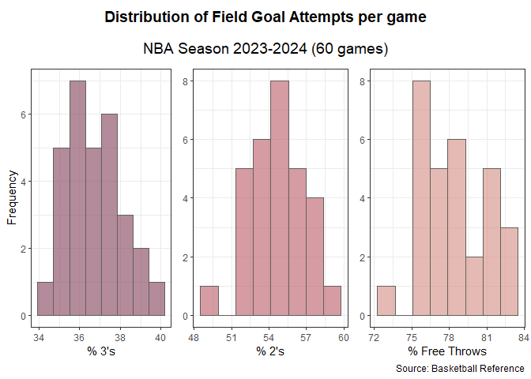
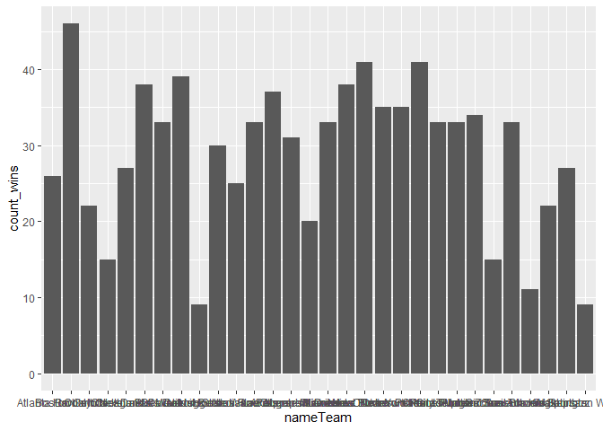
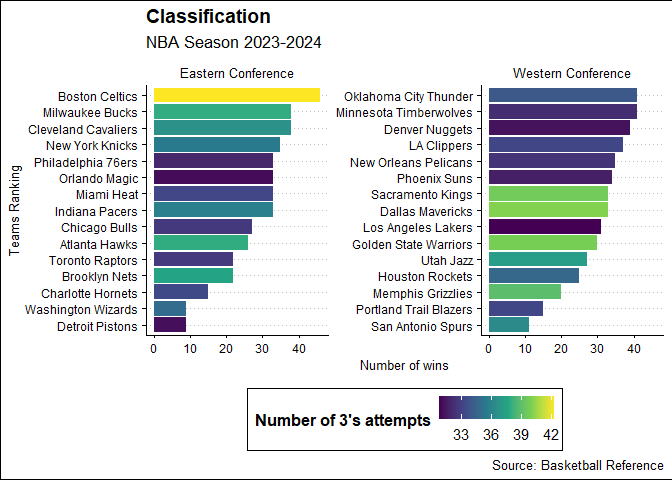
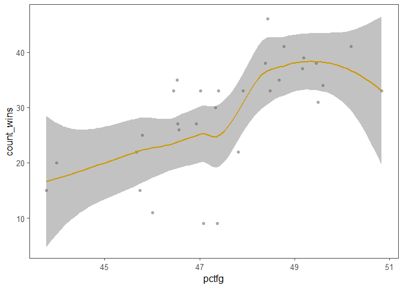
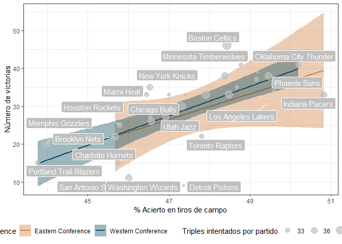
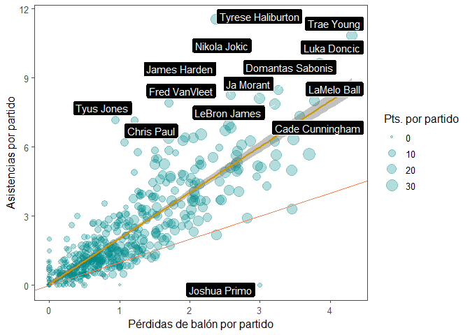
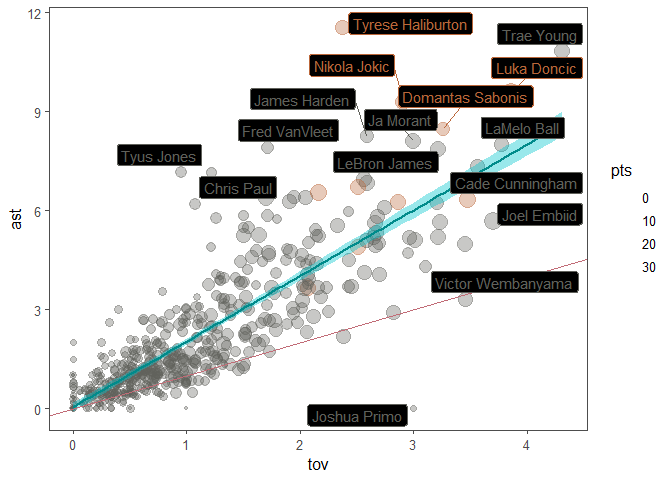

# Data Visualization in R
2024-03-07

# 1. Datos que utilizaremos en el guión

Para esta práctica utilizamos datos de la NBA de la temporada 2023/24
(en curso) a través del paquete `nbastatR` . Será necesario también
tener instalados los paquetes de `tidyverse` y algunos paquetes
adicionales para ayudar a la visualización: `ggdist` , `ggrepel`,
`cowplot` , `ggthemes` y `ggdark` .

Después de instalarlos, cargamos las bibliotecas:

``` r
library(tidyverse)
library(here)
library(nbastatR)
library(ggdist)
library(ggrepel)
library(cowplot)
library(ggthemes)
library(ggdark)
```

Y cargamos las diferentes bases de datos que vamos a utilizar del
repositorio.

``` r
players_data_pergame <- read_rds(here("players_data_pergame.rds"))
all_teams_averages <- read_rds(here("all_teams_averages.rds"))
season_average_data <- read_rds(here("season_average_data.rds"))
per_game_scorers_all <- read_rds(here("per_game_scorers_all.rds"))
```

# 2. Estudiar distribuciones de nuestras variables

Estudiar la composciión y distribución de nuestras variables es
fundamental antes de cualquier otro análisis. Esto implica ver qué rango
de valores adopta, qué frecuencia toma cada valor y qué función de
distribución se ajusta mejor a nuestros datos (ej. normal, poisson,
log-normal, etc).

Para ello, lo más útil son los **histogramas**.

### Ejemplo 1. Porcentaje de triples:

Vamos a usar la base de datos `season_average_data` (echadle un ojo
primero al aspecto que tiene). Vamos a ver cómo se distribuyen los
porcentajes de acierto en triples en todos los equipos.

Buscamos un histograma: `geom_histogram()`

``` r
ggplot(data = season_average_data, aes(x = pct3))+
  geom_histogram()
```


Nos hacemos ya una idea de valores. Vamos a ajustarlo un poco para
llegar a la siguiente figura:

``` r
three_pointers_perc_hist <- ggplot(data = season_average_data, aes(x = pct3))+
  geom_histogram(fill = "#e75719", color = "#08052f",
                 alpha = .7,bins = 10)
three_pointers_perc_hist
```



Y ahora vamos a personalizar un poco:

- Añadir una línea vertical en la media y en la mediana de acierto en
  triples

- Cambiar los nombres de los ejes a: “% Acierto en Triples” y
  “Frecuencia”

- Vamos a usar un tema del paquete `ggthemes`

``` r
mean_pct3 <- mean(season_average_data$pct3)
median_pct3 <- median(season_average_data$pct3)

three_pointers_perc_hist+
  geom_vline(xintercept = mean_pct3, 
             linetype = "dashed",
             color = "#08052f")+
  geom_vline(xintercept = median_pct3,
           linetype = "dotted",
           color = "#241aa5")+
  labs(x = "% Acierto en Triples",
       y = "Frecuencia",
       )+
  theme_clean()
```


Podemos hacer exactamente lo mismo con una curva de frecuencia continua
(*density*) en vez de discreta (*bins*). Lo hacemos con `geom_density()`

``` r
three_pointers_perc_density <- ggplot(data = season_average_data, aes(x = pct3))+
  geom_density(fill = "#e75719", color = "#08052f",
                 alpha = .7)+
  geom_vline(xintercept = mean_pct3, 
             linetype = "dashed",
             color = "#08052f")+
  geom_vline(xintercept = median_pct3,
           linetype = "dotted",
           color = "#241aa5")+
  labs(x = "% Acierto en Triples",
       y = "Frecuencia",
       )+
  theme_solarized()
three_pointers_perc_density
```



### Ejemplo 2. Figuras compuestas:

Vamos a juntar en una misma figura un histograma de triples encestados
(`fg3m`) y de tiros de campo intentados (`fga`). Lo haremos con
`cowplot`. Para ello, los pasos son:

1.  Diseñar un título con `ggdraw() + draw_label()`
2.  Diseñar la figura de `fg3m`
3.  Diseñar la figura de `fga`
4.  Unir la fila de figuras con `plot_grid()`
5.  Componer la figura total con `plot_grid()`

``` r
my_title <- ggdraw()+
  draw_label("Datos sobre tiro")

fg3m_attempts_hist <- ggplot(data = season_average_data, aes(x = fg3m))+
  geom_histogram(fill = "#70354B", color = "#08052f", bins = 8, alpha = 0.67)+
  labs(x = "Field goal 3's attempts",
       y = "Frequency",
       title = "Distribution of Field Goal Threes Attempts per game",
       subtitle = "NBA Season 2023-2024 (60 games)",
       caption = "Source: Basketball Reference")+
  theme_bw()

field_goal_attempts_hist <- ggplot(data = season_average_data, aes(x = fga))+
  geom_histogram(fill = "#1E7C6A", color = "#08052f", bins = 8, alpha = 0.67)+
  labs(x = "Field goal attempts",
       y = "Frequency",
       title = "Distribution of Field Goal Attempts per game",
       subtitle = "NBA Season 2023-2024 (60 games)",
       caption = "Source: Basketball Reference")+
  theme_bw()

fg_row <- plot_grid(fg3m_attempts_hist, field_goal_attempts_hist, nrow = 1)
plot_grid(my_title,
          fg_row,
          nrow = 2, rel_heights = c(0.1, 1))
```



### Ejercicio 1. Estudiar los tiros libres intentados por partido:

Esta variable se llama `fta` (*free throw attempts*) en la base de datos
de `season_average_data` . Hay que lograr una figura como la siguiente:
¿cómo lo haríais?

``` r
freethrow_attempts_hist <- ggplot(data = season_average_data, aes(x = fta))+
  geom_histogram(fill = "#e75719", color = "#08052f", bins = 8, alpha = 0.67)+
  labs(x = "Free Throw attempts",
       y = "Frequency",
       title = "Distribution of Free Throw Attempts per game",
       subtitle = "NBA Season 2023-2024 (60 games)",
       caption = "Source: Basketball Reference")+
  theme_bw()

freethrow_attempts_hist  
```


### Ejercicio 2. Figura compuesta de porcentajes de tiros (triples, tiros de dos, tiros libres)

``` r
fg_pct_3 <- ggplot(data = season_average_data, aes(x = pct3))+
  geom_histogram(fill = "#8D5268", color = "#60615B", bins = 8, alpha = 0.67)+
  labs(x = "% 3's",
       y = "Frequency",
       caption = " ")+
  theme_bw()

fg_pct_2 <- ggplot(data = season_average_data, aes(x = pct2))+
  geom_histogram(fill = "#C16B76", color = "#60615B", bins = 8, alpha = 0.67)+
  labs(x = "% 2's",
       y = NULL,
       caption = " ")+
  theme_bw()

fg_pct_ft <- ggplot(data = season_average_data, aes(x = pctft))+
  geom_histogram(fill = "#D8988F", color = "#60615B", bins = 8, alpha = 0.67)+
  labs(x = "% Free Throws",
       y = NULL,
       caption = "Source: Basketball Reference")+
  theme_bw()

library(cowplot)
my_title <- ggdraw()+
  draw_label("Distribution of Field Goal Attempts per game",
             fontface = 'bold')
my_subtitle <- ggdraw()+
  draw_label("NBA Season 2023-2024 (60 games)", fontface = "plain")

plots_row <- plot_grid(fg_pct_3, fg_pct_2, fg_pct_ft, nrow = 1)

pct_all <- plot_grid(my_title,
                     my_subtitle,
                     plots_row,
                     nrow = 3, rel_heights = c(0.1, 0.1, 1))
pct_all
```



# 3. Comparar variables categóricas

Para comparar variables categóricas podemos utilizar distintos tipos de
gráficas. Las más comunes son *gráficos de barras* o *barplots*,
*gráficos de caja-bigotes* o *boxplots* y sus variantes.

## Barplots

Son las más utilizadas aunque tengan ciertos problemas que luego
veremos.

Con *ggplot*, utilizaremos la función `geom_bar()` con el argumento
`stat = "identity"` .

### Ejemplo 1. Clasificación de equipos por número de victorias

Vamos a ver el ejemplo más básico sin ningún argumento más.

``` r
ggplot(data = season_average_data, aes(x = nameTeam,
                                       y = count_wins))+
  geom_bar(stat = "identity")
```



Esto no nos indica demasiado. Vamos a mejorar la gráfica:

1.  Intercambiar los ejes para que se lean los equipos con
    `coord_flip()`

``` r
ggplot(data = season_average_data, aes(x = nameTeam,
                                       y = count_wins))+
  geom_bar(stat = "identity")+
  coord_flip()
```


2.  Ordenar de menor a mayor con la función `fct_reorder` del paquete
    `forcats`. Y colorear en función de la conferencia

    ``` r
    ggplot(data = season_average_data, aes(x = fct_reorder(nameTeam, count_wins),
                                           y = count_wins))+
      geom_bar(stat = "identity",
               aes(fill = conference))+
      coord_flip()
    ```

    

    3.  Colorear por número de victorias (no se muestra)

    4.  Colorear por porcentaje de triples

    5.  Personalizar ejes

    6.  Dividir por conferencias Este y Oeste

``` r
clas_teams_color_threes <- ggplot(data = season_average_data, aes(x = fct_reorder(nameTeam, count_wins),
                                                                  y = count_wins))+
  geom_bar(stat = "identity",
           aes(fill = fg3a))+
  scale_fill_viridis_c()+
  labs(y = "Number of wins",
       x = "Teams Ranking",
       fill = "Number of 3's attempts",
       title = "Classification",
       subtitle = "NBA Season 2023-2024",
       caption = "Source: Basketball Reference")+
  coord_flip()+
  facet_wrap(~conference, scales = "free_y")+
  theme_clean()+
  theme(legend.position = "bottom")
clas_teams_color_threes
```



### Ejemplo 2. Barras y errores:

Vamos a utilizar la base de datos `all_teams_averages` :

``` r
head(all_teams_averages)
```

    # A tibble: 6 × 4
      nameTeam      conference         metric score
      <chr>         <chr>              <chr>  <dbl>
    1 Atlanta Hawks Eastern Conference fgm     43.6
    2 Atlanta Hawks Eastern Conference fga     93.7
    3 Atlanta Hawks Eastern Conference fg3m    13.7
    4 Atlanta Hawks Eastern Conference fg3a    37.9
    5 Atlanta Hawks Eastern Conference fg2m    30.0
    6 Atlanta Hawks Eastern Conference fg2a    55.8

A continuación, vamos a representar un gráfico de barras que represente
el porcentaje de triples en cada una de las conferencias, donde los
errores de las barras sean la desviación típica. Para ello, primero
vamos a filtrar la desviación típica para el porcentaje de triples en
cada conferencia.

``` r
three_perc_error_all <- all_teams_averages |> 
  filter(metric == "pct3") |> 
  group_by(conference) |> 
  summarise(sd_threes = sd(score),
            mean_threes = mean(score))
head(three_perc_error_all, 10)
```

    # A tibble: 2 × 3
      conference         sd_threes mean_threes
      <chr>                  <dbl>       <dbl>
    1 Eastern Conference     0.985        36.4
    2 Western Conference     1.75         37.0

A continuación, vamos a plotear. Utilizaremos la función `geom_errorbar`
para añadir las barras de error a las gráficas de barras

``` r
ggplot(three_perc_error_all, aes(x = conference, y = mean_threes))+
  geom_bar(stat = "identity", 
           aes(fill = conference),
           width = 0.5)+
  geom_errorbar(aes(ymin = mean_threes - sd_threes,
                    ymax = mean_threes + sd_threes),
                color = "darkslategray", width = 0.2)+
  theme_bw()+
  theme(legend.position = "none")
```


### Ejercicio 1. Clasificación de mejores equipos de cada conferencia:

Hacer una figura compuesta con la clasificación de cada conferencia
(Este y Oeste) en las siguientes categorías.

- Porcentaje de acierto en triples `pct3`

- Rebotes `treb`

- Asistencias `ast`

- Porcentaje de acierto en tiros de campo `pctfg`

Las barras deben estar coloreadas en función de la variable *puntos por
partido* (`pts`).

## Boxplots

Los *boxplots* mejoran la información de los barplots: ya no solo nos
hablan de cuál es el valor promedio y su error, sino también de la
distribución de parte de los datos.

La geometría se denomina en *ggplot* `geom_boxplot`.

### Ejemplo 3. Boxplots

Volvamos a utilizar la base de datos de `all_teams_averages` . Vamos a
dibujar un boxplot para cada porcentaje de tiro (% triples `pct3`, %
tiros de dos `pct2`, % tiros de campo `pctfg` y % tiros libres `pctft`
). Ese filtrado lo hacemos aquí:

``` r
all_percentages <- all_teams_averages |>
  filter(metric %in% c("pct3", "pct2", "pctfg", "pctft"))
head(all_percentages)
```

    # A tibble: 6 × 4
      nameTeam       conference         metric score
      <chr>          <chr>              <chr>  <dbl>
    1 Atlanta Hawks  Eastern Conference pct3    36.0
    2 Atlanta Hawks  Eastern Conference pct2    53.7
    3 Atlanta Hawks  Eastern Conference pctfg   46.6
    4 Atlanta Hawks  Eastern Conference pctft   81.3
    5 Boston Celtics Eastern Conference pct3    38.2
    6 Boston Celtics Eastern Conference pct2    57.6

Como vemos, tenemos una variable x llamada `metric` y otra variable y
llamada `score`. El boxplot sería:

``` r
shooting_percentages_boxplots <- ggplot(all_percentages, aes(x = metric,
                                                             y = score))+
  geom_boxplot()
```

### Ejercicio 2. Personalizar este plot

Vamos a personalizar este gráfico:

- Añadir colores específicos en función de la métrica, utilizando
  `scale_color_manual()`.

- Añade títulos y fuente de los datos.

- Elimina la leyenda de la métrica.

- Divide el gráfico en dos *facets* por conferencias.

- Añade un tema periodístico

``` r
# let's customize a little bit

shooting_percentages_boxplots <- ggplot(all_percentages, aes(x = metric,
                                                             y = score))+
  geom_boxplot(aes(fill = metric), color = "gray67")+
  theme_wsj()+
  scale_fill_manual(values = c("#C16B76", "#8D5268", "#749DA3","#D8988F"))+
  theme(legend.position = "none")+
  facet_wrap(~conference)+
  labs(x = "Shooting metric",
       y = "Percentage",
       title = "Shooting Percentages NBA Teams",
       subtitle = "Season 23/24 (60 games played)",
       caption = "Source: Basketball Reference")


shooting_percentages_boxplots
```


## Violin plots:

Los gráficos de violín son exactamente iguales que los boxplots pero, en
lugar de mostrar una caja, muestra la curva de densidad de los datos
reflejada de forma simétrica. Por tnato, no solo nos habla de dónde está
el valor promedio y la mayoría de los datos sino de cómo se distribuye
esa “mayoría” de datos.

Utilizamos la función `geom_violin()` .

### Ejercicio 3. Violin plots para los porcentajes de tiro sin dividir por conferencia

Mismo ejercicio de antes pero con *violins*, usando un tema oscuro con
`ggdark` y superponiendo por encima de los violines unos boxplots
blancos semitransparentes. No dividas por conferencia.

``` r
percentages_violin <- ggplot(all_percentages, aes(x = metric,
                                                  y = score))+
  geom_violin(aes(fill = metric), 
              color = "gray37", 
              trim = F,
              draw_quantiles = T)+
  ggdark::dark_theme_bw()+
  scale_fill_manual(values = c("#C16B76", "#8D5268", "#749DA3","#D8988F"))+
  geom_boxplot(fill = "white", 
               alpha = 0.45, 
               color = "gray37",
               width = 0.3)+
  theme(legend.position = "none")+
  labs(x = "Shooting metric",
       y = "Percentage",
       title = "Shooting Percentages NBA Teams",
       subtitle = "Season 23/24 (60 games played)",
       caption = "Source: Basketball Reference")
percentages_violin
```


## (Para ampliar): Raincloud plots

Hay unos gráficos que combinan toda esta información de una sola vez:
los *raincloud plots* (ahora verás por qué se llaman así). Estos
gráficos muetran:

- El valor promedio

- La curva de densidad de la distribución

- Un conteo de frecuencia por puntos (similar al histograma)

Se pueden combinar con un boxplot. Se realizan con el paquete `ggdist` y
las funciones más útiles son `geom_halfeye()` para la “nube” y
`geom_statdots()` para los puntos. Con un poco de customización, queda
algo así:

``` r
#### c) raincloud plots ----
shooting_percentages_raincloud<- ggplot(all_percentages, aes(x = metric,
                                                           y = score, fill = metric))+
  ggdist::stat_dist_halfeye(adjust = .5, width = .9, 
                            .width = 0.01,
                            justification = -0.05,
                            point_color = NA)+
  ggdist::stat_dots(
    side = "left", 
    justification = 1.01,
    binwidth = .3)+ 
  geom_boxplot(width = .2,
               outlier.shape = NA,
               color = "gray32",
               fill = "gray99", 
               alpha = .7)+
  ggthemes::theme_clean()+
  scale_fill_manual(values = c("#C16B76", "#8D5268", "#749DA3","#D8988F"))+
  theme(legend.position = "bottom")+
  labs(x = "Shooting metric",
       y = "%",
       title = "Shooting Percentages NBA Teams",
       subtitle = "Season 23/24 (60 games played)",
       caption = "Source: Basketball Reference")+
  coord_flip()
shooting_percentages_raincloud
```


# 4. Comparar variables cuantitativas

En la mayoría de estudios, sin embargo, lo que haremos será visualizar
relaciones entre variables cuantitativas, lo que se conoce en general
como *regresiones*.

Algunos ejemplos serían: *abundancia ~ temperatura,* *diversidad ~
latitud, día_floración ~ temperatura_máxima*, etc.

Para ello, lo más utilizado son los ***scatterplots*** o **diagramas de
dispersión** combinados con líneas de tendencia.

### Ejemplo 1. ¿Relación entre %fg y número de victorias?

Partiendo de la base de datos anterior de `season_average_data`, nos
preguntamos si existe una relación entre el porcentaje de acierto en los
tiros a canasta y el número de victorias de un equipo.

Cabe esperar que tengan una correlación positiva (a más acierto con los
tiros, mayor número de victorias). Lo vamos a evaluar con un diagrama de
puntos que tiene los siguientes elementos:

- Puntos: con la geometría `geom_point()`

- Tendencia: con la geometría `geom_smooth()`

``` r
pctfg_countwins_scatter <- ggplot(data = season_average_data,
                                  aes(x = pctfg,
                                      y = count_wins))+
  geom_point(color = "darkgrey")+
  geom_smooth()+
  theme_few()
pctfg_countwins_scatter
```



Vamos a intentar arreglar el gráfico:

- Que el tamaño del punto sea en función del número de triples
  intentados, para ver qué relación existe entre estas dos variables y
  el número de triples que intenta un equipo (es decir, si a más triples
  intentados más victorias o mejores/peores porcentajes de tiro.

- Vamos a nombrar los puntos más relevantes para saber a qué equipo
  corresponden los puntos más destacados usando `ggrepel::`

- Vamos a dividir el gráfico por conferencia

- Vamos a trazar una línea de tendencia lineal con `method = "lm"`
  dentro de `geom_smooth()`

``` r
ggplot(data = season_average_data,
                                  aes(x = pctfg,
                                      y = count_wins))+
  geom_point(aes(size = fg3a), alpha = .7, color = "darkcyan")+
  geom_smooth(method = "lm")+
  theme_bw()+
  facet_wrap(~conference)+
  labs(x = "% Acierto en tiros de campo",
       y = "Número de victorias",
       size = "Triples intentados")+
  ggrepel::geom_label_repel(aes(label = nameTeam),
                            fill = "#7FD3C3", 
                            alpha = .5)
```


Otra alternativa para diferenciar por conferencia sin separar las
gráfiacs es dibujar dos líneas de tendencia distintas diferenciadas por
color. Vamos además a ponerle la paleta que queramos.

``` r
ggplot(data = season_average_data,
       aes(x = pctfg,
           y = count_wins))+
  geom_smooth(method = "lm",
              aes(color = conference,
                  fill = conference))+
  geom_point(aes(size = fg3a), 
             alpha = .7, 
             color = "gray")+
  scale_color_manual(values = c("#CF8143","#0E4D62"))+
  scale_fill_manual(values = c("#CF8143","#0E4D62"))+
  theme_bw()+
  labs(x = "% Acierto en tiros de campo",
       y = "Número de victorias",
       size = "Triples intentados por partido")+
  ggrepel::geom_label_repel(aes(label = nameTeam),
                            fill = "gray75", 
                            alpha = 1,
                            max.overlaps = 8)+
  theme(legend.position = "bottom")
```



### Ejercicio 1. ¿hay relación entre tiros intentados de triple y número de victorias?

Es decir, ¿le interesa a un equipo tirar cuantos más triples mejor?

### Ejercicio 2. Relación asistencias/pérdidas de cada jugador

Vamos a utilizar la base de datos `players_data_pergame`.

Queremos el siguiente gráfico (se muestra abajo) con:

- La identidad de los puntos más reseñables

- Añadir una línea que muestre el ratio 1:1 (una asistencia por cada
  pérdida)

- La transparencia del punto para evitar solapamientos

- El tamaño del punto en función del número de puntos por partido

``` r
ggplot(data = players_data_pergame,
                                    aes(x = tov,
                                        y = ast))+
  geom_point(aes(size = pts),
             alpha = .3,
             color = "darkcyan")+
  geom_smooth(method = "lm")+
  geom_abline(slope = 1, intercept = 0, color = "coral")+
  ggthemes::theme_few()+
  ggrepel::geom_label_repel(aes(label = namePlayer))+
  labs(x = "Pérdidas de balón por partido",
       y = "Asistencias por partido",
       size = "Pts. por partido")
```



### (Para ampliar) Ejemplo 2. Subrayar elementos específicos

Vamos a ejemplificar cómo podemos colorear los puntos que queramos
específicamente. Para ello:

1.  Seleccionamos los 10 jugadores mejor valorados de la temporada que
    queremos destacar en la gráfica.
2.  Añadimos una columna llamada “colorado” con códigos de color: un
    código (“\#codigo”) para esos jugadores y otro código gris para el
    resto. Lo hacemos con función
    `if_else(condition, to do if true, todo if false)`.
3.  Añadimos que el color del punto dependa de la columna `colorado` con
    `aes(color = colorado)`
4.  Añadimos un `scale_color_identity()`

``` r
# how if we want to highlight the top ten?
mvp_tracker <- c("Nikola Jokic", "Shai Gilgeous-Alexander", "Giannis Antetokounmpo", 
                 "Luka Doncic", "Jayson Tatum", "Domantas Sabonis", "Donovan Mitchell",
                 "Tyrese Haliburton", "Anthony Davis", "Jalen Brunson")

players_data_pergame_highlight <-  players_data_pergame |> 
  mutate(colorado = if_else(namePlayer %in% mvp_tracker,
                            "#BB673A",
                            "#60615B"))

turnovers_assists_scatter <- ggplot(data = players_data_pergame_highlight,
                                    aes(x = tov,
                                        y = ast))+
  geom_point(aes(size = pts,
                 color = colorado),
             alpha = .35)+
  geom_smooth(method = "lm",
              color = "darkcyan", 
              fill = "turquoise3")+
  geom_abline(intercept = 0, slope = 1, color = "#C16B76")+
  ggthemes::theme_few()+
  ggrepel::geom_label_repel(aes(label = namePlayer,
                                color = colorado))+
  scale_color_identity()


turnovers_assists_scatter
```



### Ejemplo 3. Relación entre minutos jugados y puntos anotados por cada jugador

Cabe esperar que la relación no sea lineal: lo normal es que con más
minutos aumenten los puntos por partido de cada jugador; sin embargo,
puede saturarse la curva (por cansancio en partidos muy largos), y puede
que los jugadores con pocos minutos apenas anoten porque tengan roles
muy secundarios en sus equipos. Vamos a utilizar una regresión *loess*
en vez de utilizar un modelo lineal.

Utilizaremos la base de datos `per_game_scorers_all` con Utilizaremos
también un color negro de fondo. Para corregir el enorme solapamiento
(son datos de cada jugador), además de la transparencia, moveremos un
poquito los puntos aleatoriamente, lo que se conoce como *jittering* con
el argumento `position = position_jitter()` y lo haremos en fondo negro
para maximizar el impacto de la gráfica.

``` r
minutes_points_scorers_all <- ggplot(data = per_game_scorers_all,
                                     aes(x = minutes,
                                         y = pts))+
  geom_point(alpha = .1, position = position_jitter(width = 0.5, height = 0.5),
             color = "#E3AF4A")+
  geom_smooth(method = "loess",
              color = "#D5ADCD", 
              fill = "#C16B76")+
  ggdark::dark_theme_bw()
minutes_points_scorers_all           
```


# 5. Recursos web para visualización

- [Data to Viz](https://www.data-to-viz.com/) : a partir de cada tipo de
  datos, sugiere qué estrategia de visualización utilizar

- [R Graph Gallery](https://r-graph-gallery.com/): web con mnultitud de
  gráficas y el código que las genera

- [R Charts](https://r-charts.com/): similar a la anterior

- [R For Data Science](https://r4ds.hadley.nz/data-visualize.html)
  (book): Capítulo 3 sobre visualización de datos del libro de Hadley
  Wickham

- [Coolors](https://coolors.co/): Web para generar paletas de colores

- [Datanovia R Color
  Palettes](https://www.datanovia.com/en/blog/top-r-color-palettes-to-know-for-great-data-visualization/)
